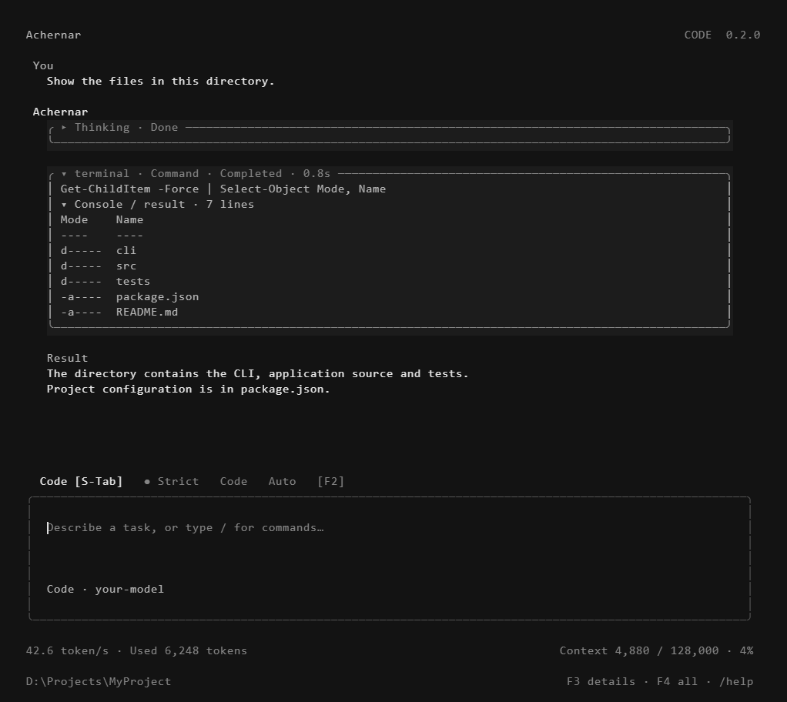

# Achernar Code

A terminal coding agent with live approval controls, resumable sessions and bundled Skills.

[中文介绍](README.zh-CN.md) · [Full usage guide](USAGE.md) · [Evaluation data](docs/EVALUATION.md) · [Release notes](RELEASE_NOTES.md)

**CLI preview: 0.2.0-rc.8.** The desktop application is not released. Bring your own model endpoint and credentials; no model subscription or API credits are included.

This candidate adds runtime settings, transient request retries, configurable command/task deadlines, regex/glob search, scrollable diff approvals and automatic file diagnostics. See [reliability status](docs/RELIABILITY.md) for implemented behavior and remaining work.

rc.8 keeps the system prompt stable across rounds so provider prompt caches can hit, measures the request deadline as inactivity, and reports task timeouts with a resume hint. See [release notes](RELEASE_NOTES.md).



*Renderer preview of the actual terminal cell grid, using fixture content; not a native terminal capture or a model benchmark.*

## Install

Requires **Node.js 22.22.2+**. One command installs the global `achernar` executable:

```powershell
npm install -g achernar-code
achernar --version
```

Updates ship through the same registry: run `npm install -g achernar-code@latest`, or type `/update` inside the CLI to check and install the newest release.

Alternative install from GitHub, without the npm registry:

```powershell
npm install -g https://github.com/JiuYue0820/achernar-code/releases/download/v0.2.0-rc.8/achernar-code-0.2.0-rc.8.tgz
```

Or install the tagged source with Git:

```powershell
npm install -g github:JiuYue0820/achernar-code#v0.2.0-rc.8
```

## First task

Start in the project directory you want to work on:

```powershell
cd D:\Projects\YourProject
achernar
```

Use `/model add` to configure the provider, base URL, API key, model ID and protocol. Type `/` for commands.

- **F2** changes approval policy while a task runs: Strict, Code or Auto.
- **Shift+Tab** changes execution mode: Code, Plan or Review. Plan/Review enforce read-only tools.
- **Ctrl+O / Ctrl+T** toggle tool details and model-provided thinking text.
- Type another instruction during execution to queue a correction at the next model/tool boundary.
- `/session` resumes saved conversations. Press **Delete** or click **Del Delete** to delete the selected history record with confirmation; project files are kept. Running-session locks prevent deletion. Tips and `/shortcuts` explain the controls.
- `/skills`, `/plugins`, `/mcp` and `/model import` manage extensions and models.
- **Ctrl+P** / `/commands` searches commands; `/settings` groups model, runtime, budget and integration controls.
- `/files`, `/search`, `/git`, `/diff`, `/output` open local source/results viewers without model calls. Code retains indentation and syntax colors; Escape returns to the draft.
- `run --task-file task.md` and `run --stdin` accept multiline code input.
- `/reasoning` selects or customizes per-model reasoning levels. In `/model`, **Ctrl+E** edits and **Delete** removes a saved profile.
- Drag to select text while a task runs; **Ctrl+C** copies the frozen selection and **Esc** resumes the live view. Click a gray user message to copy or rewind; `/shortcuts` configures keys.
- `/language` switches the interface language; `/update` checks official releases and controls update notifications. See [updates and release setup](docs/UPDATES.md).

## What it does

- Reads, edits and verifies real project files, with approval enforced at tool execution.
- Supports OpenAI-compatible Chat Completions, Responses, Anthropic Messages and Gemini protocols.
- Includes **13 coding Skills and 7 CLI-compatible official Plugins**, including coding, web research and UI design.
- Ships three original offline HTML templates: workbench, data overview and editorial. The agent can copy a template through a file tool, then adapt it.
- Displays progress separately from the final result, with foldable tool/console cards and a tool-derived run summary.
- Provides JSON and JSONL output for scripts, plus bounded task rounds and recoverable failure records.
- Adds native Git tools, explicit USD budgets and fallback models, user pre/post hooks, task undo/redo and redacted session export.
- Main controls and notifications follow English/Chinese/Russian/Japanese/Korean/Spanish locales; technical details use English fallback. Machine status/error fields stay English.

```powershell
achernar --json doctor
achernar run --plan "Inspect this project and propose a small change"
achernar --stream-json run --approval code "Fix the parsing error and run the relevant tests"
```

## Code intelligence and integrations

- Bundled JS/TS LSP: symbols, definitions, references, hover and compiler diagnostics.
- `/shell` selects the command shell; `/sandbox` selects host, restricted file writes, Windows Job process limits or Docker execution. Job mode limits process count/memory and cleans up child processes. Restricted/Job modes retain host MCP/LSP and do not isolate filesystem or network access.
- `achernar ide --write` adds VS Code terminal tasks while preserving existing tasks.
- `achernar extensions pack/import` shares hashed Skill/plugin bundles; imported MCP remains disabled.

See [code intelligence and execution](docs/CODE_INTELLIGENCE.md) and [integration instructions](docs/INTEGRATIONS.md).

## Evaluation, without rankings

We publish **Achernar-only measurements**, including incomplete runs and evaluator-assisted continuations. See [evaluation data and methodology](docs/EVALUATION.md) and [implemented reliability features](docs/RELIABILITY.md).

**September 27 reasoning regression:** `deepseek-flash` at `low` and `deepseek-v4-pro` at `high`, through `https://api.deepseek.com`, each passed 5/5 fixed coding tasks. Separate `none` and custom `max` typed-edit checks passed 1/1 each. The new OpenCode Zen credential check returned HTTP 401 and produced no successful run. Exact effort, tokens, elapsed time and estimated cost are retained in the report.

**New fixed-suite model: `agnes-3.0-flash`, through `https://apihub.agnes-ai.com/v1`.** Two runs passed 3/3 and 2/3; the second retained an HTTP 429 completion failure. These six small task attempts are not a broad quality guarantee. Run `achernar eval --live --out <fresh-directory>` to evaluate your configured model; this uses provider credits.

On September 27 the suite expanded to five tasks and two models: `agnes-3.0-flash` and `agnes-2.5-flash` on the same endpoint. Both full matrices passed 2/10; the first had seven HTTP 429 failures and one edit-argument incompatibility, the second had eight HTTP 429 failures. After the compatibility fix, a separate `agnes-2.5-flash` typed-edit rerun passed 1/1 with `oldText/newText` and clean LSP diagnostics. This targeted check does not replace the full failed runs.

**Test model: `space-bunny-free`, through OpenCode Zen's OpenAI-compatible endpoint, on September 26, 2026.** The provider alias identifies the model service. Package and permission checks use a separate deterministic local fixture.

One repair task finished in 77.769 seconds with 13 tool calls and 11 tests. A CSV task still did not finish after two 240-second attempts, despite passing artifact checks. A UI task needed an assisted continuation before completing its README. These are individual development observations, not promised performance or first-attempt success rates.

## Limits

- This is the standalone coding CLI. Desktop pets, speech runtimes and native desktop control are not included.
- Default host execution uses your permissions. Opt-in Docker isolates terminal commands only; native files, model requests and web reads are outside that boundary. MCP and LSP are disabled during Docker tasks. See [execution boundaries](docs/CODE_INTELLIGENCE.md).
- Built-in semantic tooling currently supports JavaScript/TypeScript. Docker needs a running Linux engine and a pre-pulled image; there is no host fallback.
- Third-party providers, MCP servers and services have their own access requirements and costs.
- Long tasks can still need intervention or continuation. Model quality depends on the configured provider.
- Achernar's own code is released under the [MIT License](LICENSE). Third-party notices are preserved in [THIRD_PARTY_NOTICES.md](THIRD_PARTY_NOTICES.md).

## Development and feedback

```powershell
npm ci
npm run lint
npm run format:check
npm test
npm run test:cli-coverage
npm run test:package
```

Report reproducible issues with OS, Node version, protocol, expected behavior and redacted steps. Do not attach API keys, private files or full unreviewed session logs. See [CONTRIBUTING.md](CONTRIBUTING.md).

The CLI validation workflow runs the Windows/Linux/macOS matrix and verifies an installed tarball on every push. Releases are published to the npm registry as [`achernar-code`](https://www.npmjs.com/package/achernar-code) and tagged on GitHub; `/update` inside the CLI checks the npm registry. Desktop release is disabled by construction. See [engineering boundaries](docs/ENGINEERING.md).
